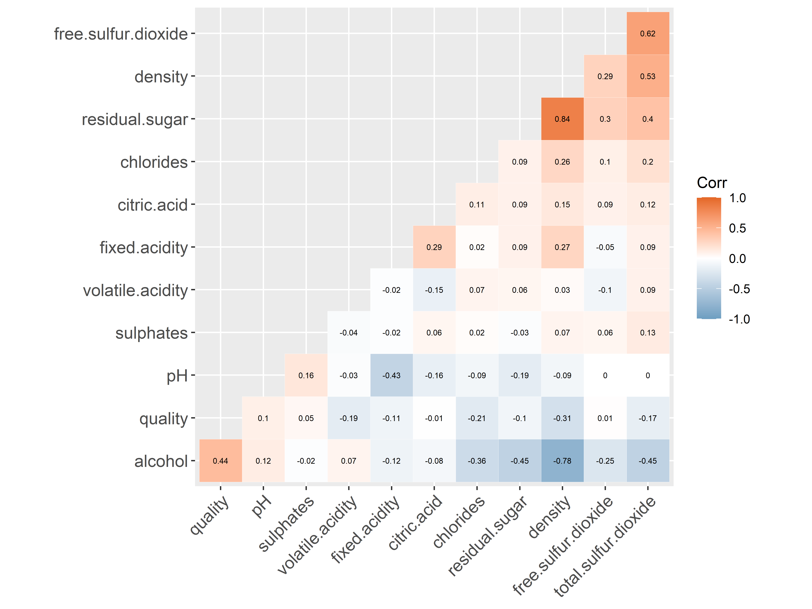
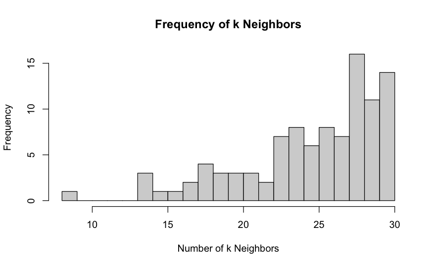

# Wine quality models

## Data

### Data overview

- **Dataset Size**: 4898 observations with 12 variables each.
- **Variables**: 
  - Input variables (physicochemical tests): fixed acidity, volatile acidity, citric acid, residual sugar, chlorides, free sulfur dioxide, total sulfur dioxide, density, pH, sulphates, alcohol percentage.
  - Output variable (sensory data): quality rating.
- **Data Range**: Illustrative example from initial observations.
  - Acidity levels: 6.2 - 8.1 g/dm3.
  - Sugar content: 1.6 - 20.7 g/dm3.
  - Sulfur dioxide: 97 - 186 mg/dm3 (total).
- **Quality Rating**: Scale used (e.g., 0-10).
  - In the actual data only 3-9 observations.
- **Data Source**: Portuguese "Vinho Verde" [Cortez et al., 2009]
- **Purpose of Analysis**: Correlating chemical properties with sensory quality.

Versions of dependent variable:
- **Continuous**: Quality ratings as a continuous variable.
- **Categorical**: Quality ratings as an (ordered) categorical variable.
- **Binary**: Quality ratings < 6 equals 0, otherwise 1. (Good/bad wine) 

We use transformations on the independent variables to capture patterns in the data (plots in next slides). When these transformations are used, they are referred to as full model, where also interactions are included. These transformations are:

- `log(X)`
- `X^2`
- `|X - \bar{X}|`
- `(X - \bar{X})^2`

## Correlation Matrix

## Independent Variables by Category

## Independent Variables by Category (Binary)

# Comparison of the Models

## Best Subset Selection

- **Considers all possible combinations of $p$ predictors with the goal of identifying the best subset for a regression.**
- **We fit all $p$ models that contain exactly one predictor, all models $\binom{p}{2} = \frac{p(p-1)}{2}$ that contain exactly two predictors, etc.**

#### Advantages:
  - Simple and conceptually appealing.
  - Can yield a better model by identifying key predictors.
  - Reduces complexity of the final model.
  - Improving out-of-sample accuracy of the regression model by eliminating unnecessary predictors.

#### Disadvantages:
  - Computationally expensive.
  - Risk of overfitting with many predictors.
    - Computationally infeasible for values of $p$ greater than around 40.
  - Incapable of processing the categorical values.
  - Performs better on training data, not on new data (overfitting).

### Best Subset Selection: Model Implementation

Steps of implementation:

1. To implement the model we will start with the base linear model, with all independent variables.
2. Then we use the subset regression algorithm to determine different models including 1-11 predictor variables.
3. Finally we determine a subset of predictor variables according to the best performance using the $R^2$, adjusted $R^2$, Cp, or BIC value.

### Best Subset Selection: Model Output Overview

#### Adjusted $R^2$-values for each subset:

| 1    | 2    | 3    | 4    | 5    | 6    | 7    | 8    | 9    | 10   | 11   |
|------|------|------|------|------|------|------|------|------|------|------|
| 0.184 | 0.239 | 0.262 | 0.268 | 0.275 | 0.283 | 0.286 | 0.287 | 0.288 | 0.287 | 0.287 |

- Observing the table we can see that the subset comprising 9 predictor variables has the highest adjusted $R^2$-value.
- Improving out-of-sample accuracy of the regression model by eliminating unnecessary predictors.
- In the model using the subset with 9 predictors, citric acid and total sulfur dioxide were omitted. Both also have a correlation close to 0.
- The method using the AIC as the best subset selector suggests to use 8 predictors instead.

### Best Subset Selection: Variable Importance

## K-Nearest Neighbours

- **Predicts the output based on the majority vote of its nearest neighbors for classification, or the average for regression.**

#### Advantages:
  - Lazy learning algorithm.
    - Memory based approach.
  - Non-parametric (makes no assumptions about the underlying distribution).
  - Versatile to different calculations of proximity.
  - Intuitive and simple.

#### Disadvantages:
  - Sensitive to irrelevant features.
  - Requires a lot of memory.
  - Computationally intensive for large datasets.
  - Curse of dimensionality.

### K-Nearest Neighbours: Model Implementation - Numerical Response

- The target variable is continuous, meaning it can take any value within a range.
- The kNN algorithm in this context is used for regression, and the goal is to predict a numeric value representing the quality of wine.

Steps of implementation:

1. Apply `kknn` function to fit the kNN model for a regression problem where the outcome is numerical.
2. Determine the optimal k by assessing the model with the lowest root mean square error (RMSE) over `kmax=30`.

### K-Nearest Neighbours: Model Output Overview

### K-Nearest Neighbours: Model Implementation - Categorical Response

- The kNN algorithm in this context is used for multi-class classification, and the goal is to predict the category to which a new observation belongs.

Steps of implementation:

1. Implement bootstrapping to create multiple subsets of the data by resampling with replacement.
2. For each subset, a kNN model is trained, and the error rate is calculated for k from 1 to 30.
3. Aggregate the results to determine the most common k (`k_most`) and the average k (`k_avg`).
4. Train the final models using these values.

### K-Nearest Neighbours: Model Output Overview

## Elastic Net (Lasso & Ridge)

### Elastic Net (Lasso & Ridge)

- **Combines L1 (Lasso) and L2 (Ridge) regularization to prevent overfitting.**

#### Advantages:
  - Handles multicollinearity.
    - Better than lasso regression by grouping correlated features and selecting the most representative ones.
  - Reduces model complexity by eliminating irrelevant features.
  - Provides a better trade-off between bias and variance by tuning the regularization parameters.
  - Can be applied to various types of data:
    - Variable selection (Lasso).
    - Shrinks coefficients (Ridge).

#### Disadvantages:
  - Selection of hyperparameters required.
  - May not always perform optimally and be easily interpretable.
  - Can be computationally intensive.
    - Due to two regularization parameters and a cross-validation process.

### Elastic Net (Lasso & Ridge): Model Implementation

- $\alpha=1$ for the Lasso model, while $\alpha=0$ for the Ridge model. The combination of the two is the Elastic Net, where $\alpha \in [0,1]$.
- For the Elastic Net, in order to find the best $\alpha$, we record the performance of the models fitted on the validation set using the steps below and marginally increase $\alpha$ to find the best fit and retrieve the best $\alpha$. This process is computationally intensive.

Steps of implementation:

1. To implement the model we will start from the full linear model, with all interactions and transformations.
2. Using `cv.glmnet` function, which returns the cross-validation performance of the model for a series of $\lambda$ values, we can identify the best $\lambda$ for a given $\alpha`.
3. With the optimal $\lambda` and the `glmnet` function we can fit the actual model.

### Elastic Net (Lasso & Ridge): Model Output Overview

#### Result table

|                   | Continuous (Ridge) | Continuous (Lasso) | Continuous (Elastic Net) | Binary (Ridge) | Binary (Lasso) | Binary (Elastic Net) | Categorical (Ridge) |
|-------------------|--------------------|--------------------|--------------------------|----------------|----------------|----------------------|---------------------|
| Lambda            | 0.0385             | 0.0009             | 0.0012                   | 0.0181         | 0.0011         | 0.0056               | 0.0168              |
| Alpha             | 0                  | 1                  | 0.93                     | 0              | 1              | 0.11                 | 1                   |
| Size              | 55                 | 55                 | 55                       | 55             | 55             | 55                   | 55                  |
| RMSE/Misc. Error  | 0.7254             | 0.7209             | 0.7211                   | 0.2384         | 0.2343         | 0.2367               | 0.4718              |

### Elastic Net (Lasso & Ridge): Variable Importance

## Random Forest

### Model Implementation

1. To implement the models, we use the package **randomForest**.
2. We fit three different models with the following specifications:
    - **ntree = 1000, mtry=3**
    - **ntree = 1000, mtry=5**
    - **ntree = 1000, mtry=3, maxnodes=20**
    which gives us 9 models in total.
3. We predict the values for the test data to obtain RMSE and misclassification errors.

Note: We tried to implement a tuning grid to find the optimal values of **mtry**. However, the errors did not seem to change much for different values of **mtry**. Hence, we chose the specification listed above for optimisation and illustrative purposes.

### Model Output Overview

#### Comparison of model performance for random forests

| Metric                        | mtry=3 (Continuous) | mtry=3 (Binary) | mtry=3 (Categorical) | mtry=5 (Continuous) | mtry=5 (Binary) | mtry=5 (Categorical) | mtry=3, maxnode=20 (Continuous) | mtry=3, maxnode=20 (Binary) | mtry=3, maxnode=20 (Categorical) |
|-------------------------------|---------------------|-----------------|----------------------|---------------------|-----------------|----------------------|-------------------------------|-----------------------------|----------------------------------|
| % Var explained               | 48.79               | -               | -                    | 48.28               | -               | -                    | 31.68                         | -                           | -                                |
| OOB estimate of error rate    | -                   | 17.44           | 35.61                | -                   | 17.72           | 35.81                | -                             | 22.95                       | 46.39                            |
| RMSE                          | 0.637               | 4.22            | 2.14                 | 0.636               | 4.24            | 2.15                 | 0.736                         | 4.21                        | 2.26                             |
| Misc. error                   | -                   | 0.184           | 0.351                | -                   | 0.182           | 0.361                | -                             | 0.237                       | 0.46                             |

#### Specification of the best-performing models:

- Numerical response: **mtry=5**
- Binary response: **mtry=5**
- Categorical response: **mtry=3**

### Variable Importance for the Best-Performing Models

# Conclusion

### Remarks

A few remarks on the implemented and not implemented models:

- Full fit actually does not include all cases for all models as the **lm** fit was, not surprisingly, singular.
- For the Categorical case: Lasso gave an error (similarly for part of Elastic net).
- Boosting gave an error for the binomial fit, and for the multinomial fit the package gives a warning that it currently does not work (using **gbm**).
- We did not use the Neural networks up to their potential as it was computationally intensive.

### Conclusion

- We used an extensive number of statistical machine learning models to assess their performance using data on wine quality. Machine learning tools are particularly useful for data sets such as this, where there is little room for common sense interpretation.
- Overall, Random Forests outperformed all other models by a large margin. This is mostly due to the nature of the data (i.e., lack of linear features), reduced probability of overfitting, and strong predictive features in both classification and regression.
- Perhaps a slightly surprising result is the overall good performance of the K-nearest neighbor model given its simplicity.
- The models do offer significant improvement in prediction compared to random guessing. It is easiest to demonstrate that in the Binary case where 66.5% of wine would be classified as Good, so the baseline misclassification is 33.5%. The random forests achieve a below 20% prediction error in the test data.

## Authors

Matej Balazovic, Eva Laznik, Maximilian Schopp, Marcell Tatar, Ema Vargova

